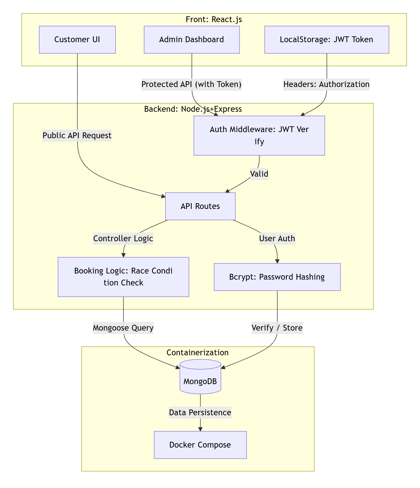
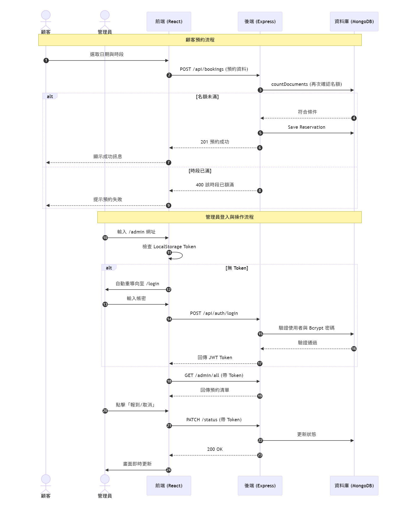

# Table-booker 餐廳預約與報到管理系統

## 1. 專案簡介
- 專案名稱：Table-booker 餐廳預約與管理系統。

- 目標：自動化管理餐廳預約流程，解決傳統紙本預約容易出錯且難以即時更新的痛點，並提供安全的後台管理預約資料，以及好操作的顧客預約介面。

## 2. 核心功能介紹
- 顧客端：
    - 查看 / 點選開放登記時段 11:00 - 20:00
    - 查看即時剩餘名額
    - 填寫兩天內預約登記資料
    - 防止超額預約

- 管理端：
    - JWT 登入 / 登出驗證管理員身分
    - 檢視所有預約者資料
    - 進行資料更動、狀態更新 : 更新報到 / 取消狀態（連動名額釋放）

## 3. 系統架構

### 使用技術

- 前端：React.js + Tailwind CSS (Vite 構建)，確保 UI 響應式佈局。

- 後端：Node.js + Express.js 處理 RESTful API，並透過中間層 (Middleware) 實施 JWT 權限攔截。

- 資料庫：MongoDB (透過 Docker Compose 部署)。

- 認證機制：JWT (JSON Web Token) 非狀態化驗證，使用 Bcrypt 加密管理員密碼。

### 目錄結構總覽
```
Table-booker/
├── backend/              
│   ├── controllers/                # 邏輯處理
│   │   └── bookingCtrl.js          # 處理預約查詢、新增、狀態更新
│   ├── middleware/                 # 中間層
│   │   └── auth.js                 # JWT 權限驗證攔截器
│   ├── models/                     # 資料庫模型 (Mongoose Schema)
│   │   ├── Reservation.js          # 預約資料模型
│   │   └── User.js                 # 管理員帳號與 Bcrypt 加密邏輯
│   ├── routes/                     # API 路由定義
│   │   ├── authRoutes.js           # 登入相關路由
│   │   └── bookingRoutes.js        # 預約管理相關路由
│   ├── .env                        
│   ├── seedAdmin.js                # 管理員帳號初始化腳本
│   ├── server.js                   # 後端入口檔案
│   └── package.json                # 後端相依套件清單
│
├── frontend/              
│   ├── src/
│   │   ├── pages/                      # 主要頁面組件
│   │   │   ├── CustomerView.jsx        # 顧客預約入口
│   │   │   ├── AdminView.jsx           # 管理看板 (含狀態更新功能)
│   │   │   └── Login.jsx               # 管理員登入頁面
│   │   ├── App.jsx                     # 前端路由配置中心
│   │   └── main.jsx                    # 前端入口檔案
│   ├── tailwind.config.js              # Tailwind CSS 配置
│   └── package.json                    # 前端相依套件清單
│
├── docs/
│   ├── architecture.png            # 系統架構圖
│   ├── flowchart.png               # 系統流程圖
│   └── api-spec.md                 # API 規格文件
│
├── docker-compose.yml              # Docker 容器編排
├── README.md                       # 專案說明文件   
└── .gitignore
```


### 系統架構圖 
  

### 系統流程圖 



## 4. 核心技術使用說明

- 採用經典 MongoDB, Express, React, Node.js 的 MERN Stack 全端架構 :   
    - 核心優勢在於全端均使用 JavaScript，減少了開發時語言切換的上下文開銷，且 MongoDB 的 JSON 格式文件非常適合儲存變動快速的預約資料。

- 分離分層架構：  
    - frontend 與 backend 徹底分離，便於未來分別部署或擴展。
    - 後端採用 Models、Routes、Controllers 的分層方式，結構清晰且易於維護。

- Middleware 設計：  
    - 將 auth.js 抽離至中間層，實現了切面導向 (AOP) 的設計思想，只要在路由中加入即可完成權限保護。

- 容器化支援：   
    - 根目錄下的 `docker-compose.yml` 統一管理基礎設施

- 後端二次驗證：  
    - 在預約寫入資料庫前，後端會再次執行 `countDocuments`，徹底杜絕因前端延遲導致的超額預約。

- 無狀態認證：  
    - 採用 JWT Token 儲存於 LocalStorage，減少伺服器負擔。

## 5. 安裝與執行指引

### 環境準備
- Git
- Docker
- Node.js (v18+)

### 步驟 1：下載專案
開啟終端機，執行以下指令將專案下載至您的本機：
```bash
# 複製倉庫
git clone https://github.com/您的用戶名/您的倉庫名.git

# 進入專案資料夾
cd Table-booker
```

### 步驟2 : 啟動環境與資料庫

本專案採用容器化技術管理資料庫，請確保 Docker 已開啟，並在專案根目錄執行以下指令啟動 MongoDB：
```bash
# 啟動 Docker 容器
docker-compose up -d

# 確認容器是否正常運作
docker ps
```

### 步驟 3：後端設定與管理員初始化

進入後端目錄進行套件安裝，為了確保管理後台安全，先手動建立一個初始管理員帳號：
```bash
# 進入後端目錄並安裝相依套件
cd backend
npm install

# 初始化管理員 (執行一次即可)，預設帳號: admin / 預設密碼: adminpassword123
node seedAdmin.js

# 啟動後端伺服器
npm run dev

```
註：成功後，終端機應顯示 MongoDB 連線成功

### 步驟 4：前端設定與啟動

開啟另一個終端機，進入前端目錄：
```bash
# 進入前端目錄並安裝相依套件
cd ../frontend
npm install

# 啟動前端開發環境
npm run dev
```
註 : 啟動後，請訪問終端機顯示的網址（通常為: http://localhost:5173）。

### 步驟 5 : 開始使用
``` bash
顧客預約頁面 : 瀏覽器開啟 http://localhost:5173
後臺管理頁面 : 瀏覽器開啟 http://localhost:5173/admin
```


## 6. 常見錯誤
1. CORS 阻擋：已在後端配置 cors() 中間件允許前端跨網域請求。

2. Token 過期：前端具備 401 自動攔截器，若 Token 失效將自動重導向至登入頁。